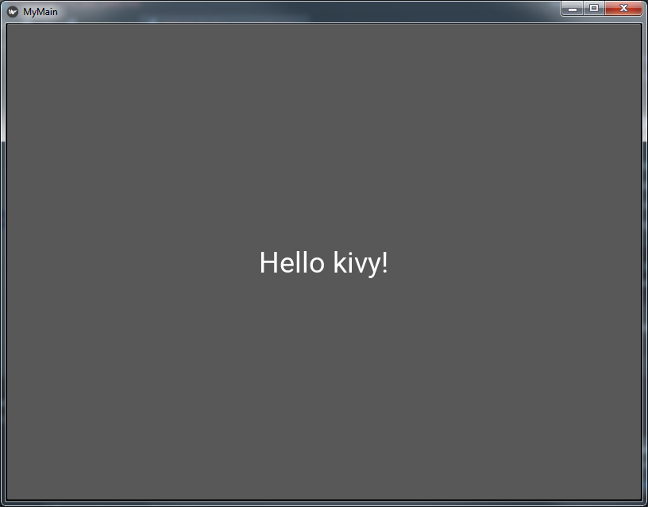
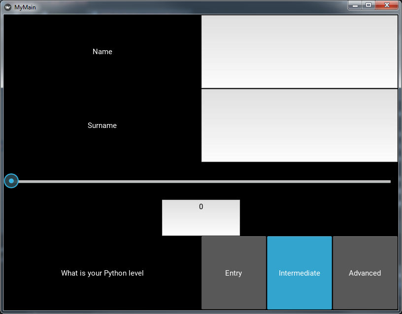

Kivy is one of the python libraries for building GUI. It is relatively new package, but the community is still growing.  

### Why kivy?
Main advantage of Kivy is MIT licence, which allows you use it without any payment. I know that PyQT is much more mature framework, but if you want to use it for commercial solution you have to consider license purchase. Also you can create executable file for any of platform (Windows, Mac, iOS, Android, Raspberry Pi). In my opinion documentation could be written better, but I hope one day it will happen.    

## Let's
First of all is installation process. Please follow carefully by point in guide:
* Linux - https://kivy.org/doc/stable/installation/installation-linux.html
* Windows - https://kivy.org/doc/stable/installation/installation-windows.html
* Mac - https://kivy.org/doc/stable/installation/installation-osx.html
 
> **Note** Currently Kivy supports Python <= 3.7 

You have to ways how to create a GUI:
1) declare widget classes in a "pure" python code
2) create separated .kv file

I recommend second option, because regarding to MVC (model-view-controller) design pattern.

Everything what you build is put on **canva** and every of screens in your app has their own. It is your root. All of components, which you can put into you application are called  **wigdets**. Wigdets can do some actions: **events**.

At the beginning we create two files:
First **simple_app_with_survey.py**

```python
from kivy.app import App
from kivy.lang import Builder


class MyApp(App):
    def build(self):
        return Builder.load_file("simple_app_with_survey_layout.kv")


if __name__ == "__main__":
    MyApp().run()
```

and second **simple_app_with_survey_layout.kv**, which stays empty and you will fill later.

This part will conduct to bind your .kv file file with a main code.

## First widget
Now try to create a welcome page.

In simple_app_with_survey.py file you have to declare class for that. Pages in kivy applications are screen. Do not forget import this.

```python
from kivy.uix.screenmanager import Screen, ScreenManager

class WelcomeScreen(Screen):
    pass

class WindowManager(ScreenManager):
    pass
```

You do not have to implement any function inside this class now. Classes will contain functions if you want to implement additional behavior. 

In simple_app_with_survey_layout.kv the object declaration has to have the same name like the class. Only in that way kivy "knows" it is referenced to your class.

```python
WindowManager:
    WelcomeScreen:

<WelcomeScreen>
    name: "welcomeScreen"
    BoxLayout:
        orientation: "vertical"
        Button:
            text: 'Hello kivy!'
            size_hint: 1, 0.4
            on_press: app.stop()
```

The size of the button cn be scaled if you change manually a size of app window. The reason is the sizes values mean percent of canva space. 

Now your application have a button with event "close application" after clicked!

I would like to say something more about layouts, before you will go to the next exercise.
In above code you probably noticed "*BoxLayout*". Every screen can be done in different layout approach. Kivy gives you:
* AnchorLayout - Widgets can be anchored to the ‘top’, ‘bottom’, ‘left’, ‘right’ or ‘center’.
* BoxLayout - Widgets are arranged sequentially, in either a ‘vertical’ or a ‘horizontal’ orientation.
* FloatLayout - Widgets are essentially unrestricted.
* RelativeLayout - Child widgets are positioned relative to the layout.
* GridLayout - Widgets are arranged in a grid defined by the rows and cols properties.
* PageLayout - Used to create simple multi-page layouts, in a way that allows easy flipping from one page to another using borders. Useful for mobile apps.
* ScatterLayout - Widgets are positioned similarly to a RelativeLayout, but they can be translated, rotate and scaled.
* StackLayout - Widgets are stacked in a lr-tb (left to right then top to bottom) or tb-lr order.

## Second page
Let's assume you need information about name, surname, age and Python level.
Call your second page as "SurveyPage". Add this part to *simple_app_with_survey.py*

```python
class SurveyScreen(Screen):
    pass
```

And in kivy file:
```python
<SurveyScreen>
    name: "surveyScreen"
    BoxLayout:
        orientation: "horizontal"
        Label:
            text: "Name"
        TextInput:
            id: name
            multiline: 'False'
            halign: "center"
            write_tab: False
``` 

A results of setting parameter *write_tab* as False is that you forbid put tab into this field.


Also you would like to skip from welcome screen to survey page. 
At the beginning of *simple_app_with_survey_layout.kv* script add:

```python

WindowManager:
    WelcomeScreen:
    SurveyScreen:
``` 

and change *on_press* event:

```python
<WelcomeScreen>
    name: "welcomeScreen"
    BoxLayout:
        orientation: "vertical"
        Button:
            text: 'Hello kivy!'
            size_hint: 1, 0.4
            on_press:
                app.root.current = "surveyScreen"
```

For changing screen you use Screen *name*.

You have just done your first multipages simple app!

Adding additional field for your survey is quite easy. Change your SurveyScreen *simple_app_with_survey_layout.kv* file:

```python
<SurveyScreen>
    name: "surveyScreen"
    BoxLayout:
        orientation: "vertical"

        BoxLayout:
            orientation: "horizontal"
            Label:
                text: "Name"
            TextInput:
                id: name
                multiline: 'False'
                halign: "center"
                write_tab: False
        BoxLayout:
            orientation: "horizontal"
            Label:
                text: "Surname"
            TextInput:
                id: surname
                multiline: False
                halign: "center"
                write_tab: False
        BoxLayout:
            orientation: "vertical"
            Slider:
                id: age
                min: 0
                max: 100
                step: 1
                padding: 15
                value: int(age_as_txt.text)
            AnchorLayout:
                TextInput:
                    id: age_as_txt
                    multiline: False
                    size_hint: 0.2, 1
                    text: str(int(age.value))
                    halign: "center"
                    write_tab: False
        BoxLayout:
            orientation: "horizontal"
            Label:
                text: "What is your Python level"
            BoxLayout:
                orientation: "horizontal"
                ToggleButton:
                    id: entry
                    text: "Entry"
                    group: "python_experience"
                ToggleButton:
                    id: intermediate
                    text: "Intermediate"
                    state: "down"
                    group: "python_experience"
                ToggleButton:
                    id: advanced
                    text: "Advanced"
                    group: "python_experience"
```

As you can see, you are able to nested Layouts (in this case BoxLayout) to adjust GUI for your needs.
A few more words about above Wigedts:
- Slider - min, max i step sounds clear, but you were able to set a value from and to text input below by:

```python
value: int(age_as_txt.text)
```  

and

```python
text: str(int(age.value))
```      

*age_as_txt* and *age* are Wigdets ids, so you can call parameters in other object
   
- ToggleButton - works like checkbox. You declare a group for all checks using *group:* parameter. If a user choose one value, later can not leave unchecked checkbox. You can force choose something trough setting a default value by putting *state: down* in one of ToggleButtons in particular group. 


Your app should looks like that:
- WelcomeScreen:


- SurveyScreen


If you are interested how to work with values from survey fields and write down them into a file please check 
Multipages application with survey tutorial in Kivy (part 2)

Whole script is available on my GitHub:
[Simple application with survey](https://github.com/tkocza/Python_hints/tree/master/kivy)

#### Thanks for reading