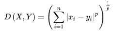
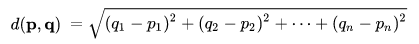
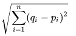
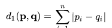
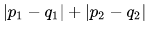
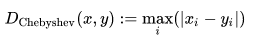

When you think about Machine Learning probably you have in mind complicated algorithms

You cannot skip the distance.
 
## Minkowski distance
When you try to image that you need to cover a distance you will say e.g. "I have to travel 10 kilometers". You will never say "-10 kilometers". It explains how we perceive a distance. this also the base for Minkowski distance theory.
The main assumption of this method is that distance always has to be positive value.

Regarding to *p* value we can transform this formula as:
- *p = 1* - Manhattan metric
- *p = 2* - Euclidean metric
- *p = ∞* - Chebyshev metric
 
## Euclidean distance
The Euclidean metric is the most often use distance in Machine Learning. It is simple straight line between two point in *n* dimensions space. 
You can also find this distance as Pythagorean metric.

in shorter version

on the graph:

![]

## Manhattan distance
This distance is also known as *Taxicab distance* or *Rectilinear distance*. The name comes from Manhattan streets grid layout. 
The distance is calculated as absolute sum of the difference between its cartesian coordinates.

on the graph:
![]

## Chebyshev distance
The metric is calculated as maximum value of absolute difference between point in compared vectors. That is the reason why it is also called *Maximum metric*.
Other name which you can see is *Chessboard distance* because represent distance between two spaces on a chess board gives the minimum number of moves a king requires to move between them.

Let's count a distance in the order to above different methods.
You have two cases:

1) two dimensions points (2D):
- A (2,4)
- B (6,8)
    
2) three dimensions points (3D):
- C (2,4,6)
- D (6,8,10)

| Metric        | 2D Formula | 2D result | 3D Formula | 3D result |
|:-------------:|:-------------:|:-------------:|:---------:|
| Euclidean     | $$ \sqrt{(2-6)^2 + (4-8)^2} $$ | | $$ \sqrt{(2-6)^2 + (4-8)^2 + (6-10)^2} $$ |
| Manhattan     | $$ \|2-6\| + \|4-8\| $$ | | $$ \|2-6\| + \|4-8\| + \|6-10\| $$  |
| Chebyshev     | $$ max\{\|2-6\|,\|4-8\|\} $$ | | $$ max\{\|2-6\|,\|4-8\|,\|6-10\|\} $$ |

## Cosine distance

## Hamming distance

## Jaccard Index

## Levenshtein distance